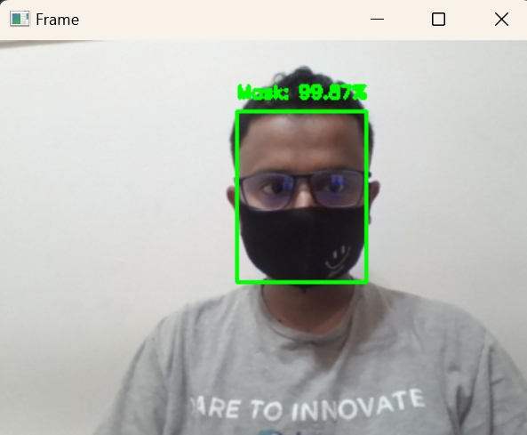

# Face Mask Detection using CNN 🏥😷

## 📌 Overview
This project is a **Face Mask Detection System** built using **Convolutional Neural Networks (CNNs)** in **TensorFlow/Keras**. It can:
- Detect whether a person is **wearing a mask** or **not** in real-time.
- Use **OpenCV** to process images and video streams.
- Train a deep learning model on a dataset of masked and unmasked faces.

---

## 📊 Training Loss and Accuracy Graph
The following graph shows the **training and validation loss & accuracy** of the model over multiple epochs.


### **Understanding the Graph**
- **X-Axis (Epoch #):** Number of times the model has gone through the dataset.
- **Y-Axis (Loss/Accuracy):** Measures how well the model is performing.
- **Red Line (Train Loss):** Lower is better (indicates learning).
- **Blue Line (Validation Loss):** If it fluctuates, the model may be **overfitting**.
- **Purple Line (Train Accuracy):** Higher is better.
- **Black Line (Validation Accuracy):** Should be close to training accuracy.

---

## 📷 Output Screenshots
### **1️⃣ Mask Detected ✅**


### **2️⃣ No Mask Detected ❌**


---

## 🚀 Installation & Setup

### **1️⃣ Install Dependencies**
Run the following command to install all required packages:
```bash
pip install -r requirements.txt

### Run the code**
Run the following command to run the face mask detector code:
```bash
python detect_mask_video.py